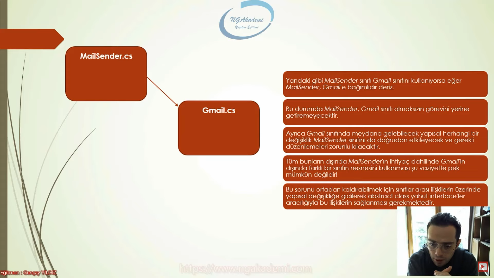
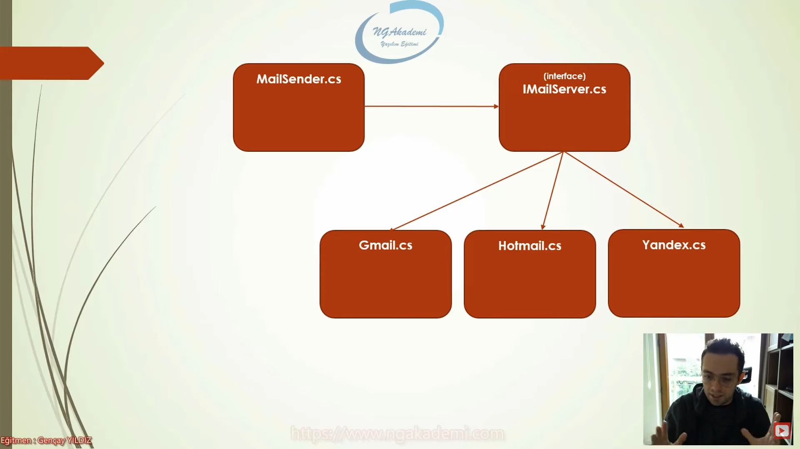

# Loose Coupling (Esnek Bağ) Nedir?

Loose Coupling, kod inşa etme sürecinde nesneleriniz arasında bir iş birliği varsa bu iş birliğini direkt tight coupling (sıkı bağımlılık) ile tasarlamaktan ziyade loose coupling olarak tasarlayın der.

Bir uygulama sürecinde işlevlerin gerçekleştirilebilmesi için nesneler üzerinden operasyonlar yürütülür. Bu nesneler kendi aralarında iş birliği yaparak birbirlerine hizmet sunmakta ve her biri görevlerini yerine getirerek uygulamayı meydana getirmektedirler.

İşte bu iş birliği neticesinde nesneler arası ister istemez bağımlılıklar meydana gelebilmektedir. 

Kısacası; iki nesne aralarında iş birliği yapıyorsa yani bir nesne farklı bir nesneyi kullanıyorsa burada bir bağımlılık var demektir.

Örneğin; telefon, günlük hayatta iletişim kurmamızı sağlayan bir nesnedir. Ve object oriented'daki nesneye karşılık gelen bir yapı olduğunu varsayalım. 

Şimdi bu telefonu kullanabilmemiz için telefonun bir sim kartının olması lazım. 

Ve bu telefonu kullanabilmek için ekstradan sim kartına da ihtiyacı olması demek, telefonun sim kartına olan bağımlılığı demek değil midir? İşte biz buradaki bağımlılığı konuşuyoruz, esnek - sıkı bağımlılıkta. 

Esnek bağdan kast edilen de şu; bu telefon sadece 'bir' sim kartına mı bağlıdır? Yoksa bu telefon evrensel olarak tüm sim kartlarına mı bağlı? Eğer ki bu telefon, sadece bir sim kartına göre üretilmiş olsaydı burada ciddi manada maliyetli olan sıkı bir bağımlılık var demek olacaktı. Ama bu telefon öyle bir üretilmiş ki yeryüzündeki bütün sim kartlarını destekleyecek şekilde yani loose coupling olacak şekilde üretilmiştir.

Telefon, sim kartına yine bağımlı. Ama biz buradaki bağımlılığın nasıl olduğunu değerlendiriyoruz. Loose coupling diyor ki; her şeyle bağımlı olabilirsin ama bu bağımlılığı mümkün mertebe esnek bir şekilde tasarla.

  

Bir nesne, kullandığı diğer bir nesne hakkında ne kadar detaya / bilgiye sahipse o nesneye olan bağımlılık o oranda artmakta ve olası bir değişiklik yahut onarılma durumunda bağımlı olan sınıfta da revizyonu gerekli kılmaktadır.

OOP tasarımlarında nesneler arasındaki bağımlılıkları yüzde yüz ortadan kaldırmanın pek mümkün olmadığını söylemekte fayda var. Bundan dolayı nesneler arasındaki bağımlılıkları ortadan kaldıramıyorsak eğer mümkün mertebe bu bağımlılığı törpülemeli bir başka deyişle bu bağımlılıkları yönetilebilir hâle getirmeliyiz. 

İyi bir tasarım; bağımsızlığın olduğu değil, bağımlılıkların kontrol edildiği tasarımdır.

 

Tight Coupling;

 

Loose Coupling;

