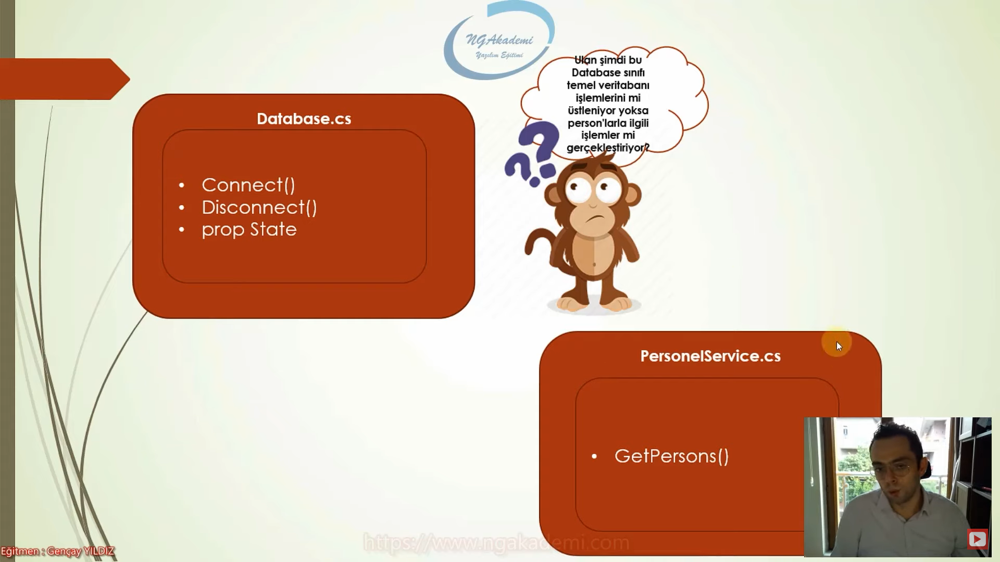

# Single Responsibility Principle (Tek Sorumluluk Prensibi) Nedir?

Single responsibility principle, oop tasarımlarında bir sınıfı mümkün mertebe tek bir sorumluluğa odaklı inşa edilmesi gerektiğini ilke olarak savunan bir prensiptir. 

Bir sınıfın değiştirilmesi gereken birden fazla sebebi / motivasyonu / gerekçesi varsa eğer işte bu durum ilgili sınıfın birden fazla sorumluluğu olduğu anlamına gelmektedir.

SRP, bir sınıfın değişmesi için tek bir nedeni olması gerektiğini ifade etmekte ve inşa edilen kodun bu hassasiyetle üretilmesini savunmaktadır.

Bir sınıfın değişmesi için yalnızca tek bir nedeni olması gerekmektedir!

Bir sınıf yahut metot, işlevsel olarak birden fazla işi / operasyonu yürütüyorsa yani birden fazla sorumluluğu varsa bu istenmeyen bir durumdur.

Ne de olsa günlük hayatta bir insan aynı anda birden fazla iş yükünü nasıl ki kaldıramıyorsa, kaldırmaya çalışsa da beklenen verim alınamıyorsa, ürettiğimiz kodlarımızda da birden fazla sorumluluğun tek bir yapıda toplanması doğru bir çalışma olmayacaktır.

Birden fazla sorumluluğun söz konusu olduğu yapılarda herhangi bir sorumluluktaki değişiklik ilgili yapının üstlendiği diğer sorumlulukların insicamını bozabilir yahut yürütülmelerini ister istemez engelleyebilir.

Bu durumları bizler genellikle kırılgan tasarımlar olarak nitelendirmekteyiz.

Her şeyi geçtik bir oop tasarımında bir yapının tek başına birden fazla işi üstlenmesi yönetilebilirlik açısından gerçekten şık bir tasarım değildir.

Neticede yazılım sürecinde her bir sorumluluk, bir işi, her bir işte bir amacı yani gayeyi temsil etmektedir. Bizler amaçlarımız doğrultusunda iş üretir ve bu iş neticesinde belirli sorumlulukları gerçekleştirecek olan yapıları inşa ederiz.

Haliyle her sorumluluğa özünde bir değişim merkezidir diyebiliriz. Çünkü yazılım süreçlerinde sorumlulukları şekillendiren gereksinimler değişken özellik göstermekte ve bu durumda sorumlulukların yürütüldüğü ilgili yapıların sürekli revize edilmesini gerektirmektedir.    

Bir sınıfın birden fazla sorumluluğu varsa eğer bu sorumluluklar her gereksinim değişikliğinde ilgili sınıf için ekstradan maliyete sebebiyet verecektir.

Ayriyeten yetmeyecek her yeni yapılanma için yeniden test ve bakım maliyetleri de haddinden fazla artacaktır. 

