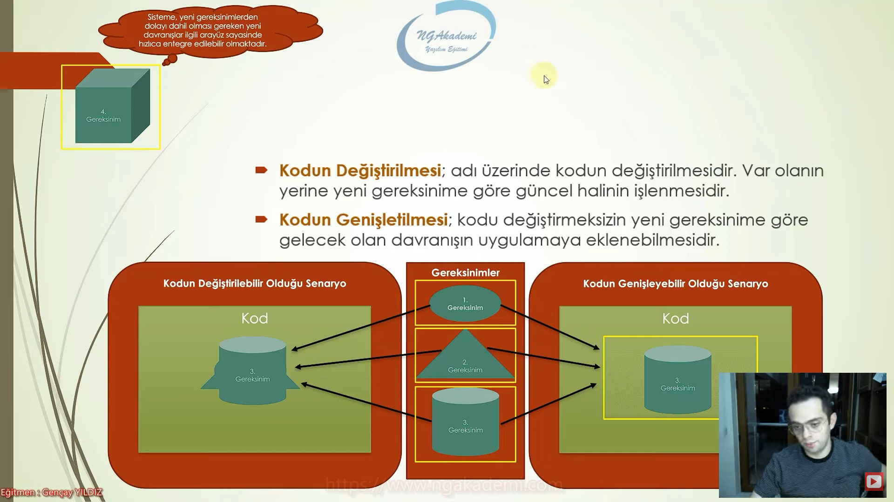

# Open Closed Principle (Açık / Kapalı) Prensibi Nedir?

Open closed principle, oop tasarımlarında bir sınıfın gereksinimler doğrultusunda değiştirmeye gerek duyulmaksızın genişletilebilir bir şekilde tasarlanmasını savunan bir prensiptir.

<h3>
Peki kodu değiştirme veya genişletme ne demek?
</h3>

Kodun Değiştirilmesi; adı üzerinde kodun değiştirilmesidir. Var olanın yerine yeni gereksinime göre güncel halinin işlenmesidir.

Kodun Genişletilmesi; kodu değiştirmeksizin yeni gereksinime göre gelecek olan davranışın uygulamaya eklenebilmesidir. 

Bir kod; genişlemeye açık, değişime kapalı olduğu taktirde ideal koddur. 

 

<h3>
Faydaları Nelerdir?
</h3>

Koda; sürdürülebilirlik, genişletilebilirlik, yeniden kullanılabilirlik, esneklik kazandırır.

Böylece kodun gelen yeni gereksinimlere göre değişiklik direncini kıracak ve geliştiriciyi bu değişiklik süreçlerindeki maliyetlerin getirdiği yığınlardan soyutlayacaktır.

