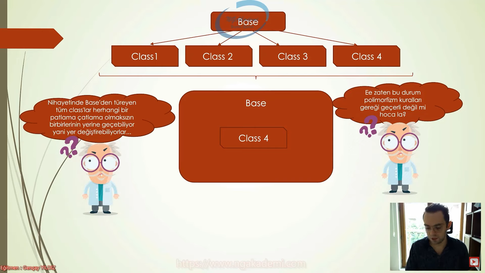
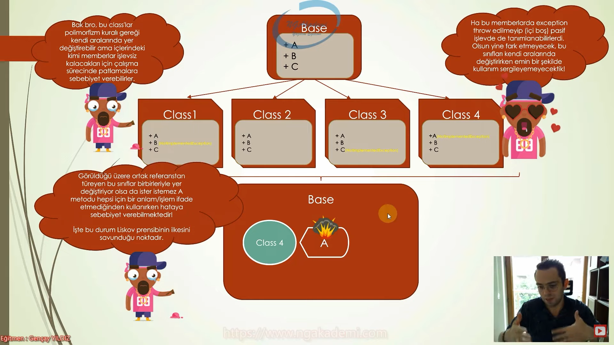

# Liskov Substitution Principle (Liskov Yerine Geçme Prensibi) Nedir?

Liskov substitution principle, ortak bir referanstan türeyen nesnelerin hiçbir şeyi bozulmadan, patlamadan, çatlamadan birbirleriyle değiştirilebilmesi gerektiğini yani birbirlerinin yerine geçebilmesi gerektiğini öneren bir prensiptir.

 

Eğer bir sınıf, herhangi bir interface yahut abstract class ile sözleşme yapıyorsa o zaman bu sözleşmeyi karşılamalı ve gerekli tüm memberları içerisinde tanımlamalıdır. Lakin bu memberlardan boş ve işlevsiz olanlar varsa işte orada bir problem var demektir.

Hiçbir alt sınıf uygulamış olduğu base class'ın metotlarını ihlal etmemelidir. Yani implement yahut override edilen hiçbir metot boş kalmamalı veya boş kalmasın diye Not Implemented Exception gibi hatalar döndürmemelidir.

Eğer böyle bir durum söz konusuysa bu nesneler birbirleri yerine geçebilir lakin ister istemez patlamalar, çatlamalar meydana gelebilir.

 

LSP, bu noktada nesnelere sadece gerçek davranışlarını barındırmasını önerir. Özellikle herhangi bir arayüzü yahut abstract class'ı uyguladığında bu arayüzün garanti ettiği gibi davranması gerektiğini ifade eder.

Yani tüm class'lara implement edilen member'lar bu davranışı sergilemelidir. Misal; A member'ı, Class 4 için geçerli olmayacaksa Class 4'e implement edilip içinin boş bırakılması yahut Not Implemented Exception fırlatılması doğru değildir.

LSP burada ya A'yı Class 4'e tanımlayacağın tarzda bir tasarım yapacaksın ya da tanımladıysan adam gibi kullanacaksın demektedir.

Aksi taktirde bu sınıflar ortak atadan gelseler dahi kendi aralarında ehemmiyetli bir şekilde yer değiştiremezler. Polimorfizm kuralları gereği değiştirse de davranışsal açıdan risk teşkil edebilmektedir.

Ortak referanstan türeyen nesneler herhangi bir davranış değişikliğine gerek duyulmaksızın birbirlerinin yerine geçebilmelidirler.

Liskov prensibini uygularken genel dağılım göstermeyen davranışlarımızı interface'lerle ayırıp o davranışları hususi olarak barındıracak olan bütün class'lara bu interface'leri implement ettirmeliyiz.

 

Son Olarak;

* Prensipleri anlamak için ne zaman ihlal edildiklerini anlamak önemlidir. Bu ilkenin ihlali ise şu noktada söz konusudur;

Bir nesnenin arayüz tarafından dayatılan sözleşmedeki davranışları yerine getirmediği durumlarda LSP ilkesine aykırılık söz konusudur.

