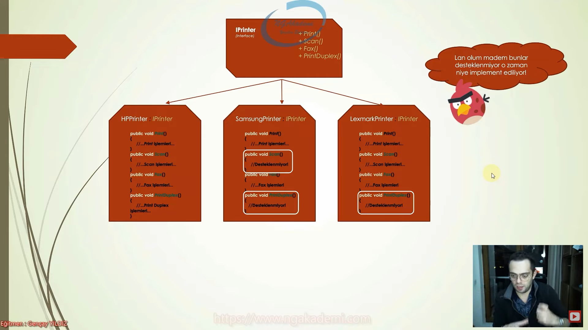
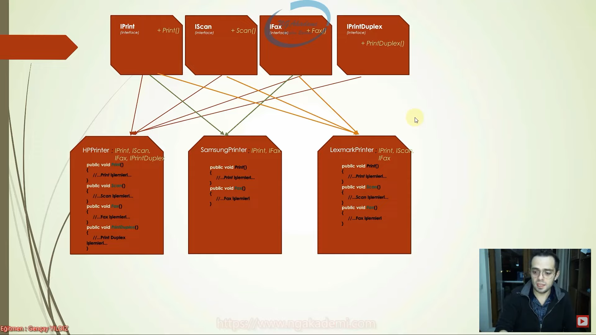

# Interface Segregation Principle (Arayüz Ayrım Prensibi) Nedir?

Interface segregation principle, bir nesnenin yapması gereken her farklı davranış(lar)ın, o davranış(lar)a odaklanmış özel interface'ler ile eşleşmesini öneren prensiptir.

Böylece ihtiyaç olan davranışları temsil eden interface'ler eşliğinde ilgili sınıflara kazandırabilir ve hiçbir sınıfın kullanmadığı bir imzayı zorla implement etmek zorunda kalmaksızın inşa sürecine devam edebiliriz.

 

Sınıflara ihtiyaç duymadıkları imzaları arayüzlere zorlayarak işlevsiz metotlar eklemek ISP'yi ihlal etmek demektir.

Böylece geliştiriciler açısından ihtiyaç duymayacakları metotlar intellisense'de kalabalığa sebebiyet verip kafalarını karıştırabilir.

Yahut interface'de oluşacak herhangi bir değişiklik ister istemez o değişiklikle alakası olmayan sınıflarda da side effect'ler yaratıp oradaki problemlerle ilgilenmeye zorlayabilir. Yani bakımı da lüzumsuz yere zorlaştırabilir.

Hacmi geniş olan ve davranışsal olarak farklı yetenekleri içerisinde barındıran interface'ler mümkün mertebe yeteneklerine göre parçalanarak küçültülmelidir.

Kümülatif olarak yetenekleri barındıran interface'ler sınıflara uygunlandığı taktirde çoğu sınıf için birçok yeteneğe ihtiyaç duyulmayacağı için anlamsız kalıp olarak tanımlanıp kalacaktır. Bu da istenmeyen bir durumdur.

Genellikle bu tarz istenmeyen durumlar salt olarak NotSupportedException veya NotImplementedException gibi hataların fırlatıldığı metotlarda fark edilebilmektedir. Bu tarz metotlar varsa ISP açısından olayın / inşanın değerlendirilmesinde fayda vardır.

Az önceki örneğin interface segregation principle'a göre doğru tasarımı aşağıdaki gibi olmalıdır. 

 

Yazılımdaki davranışları tek bir bütün olarak tutmaktansa, birbirlerinden bağımsız olacak şekilde birden çok parçaya bölmek ideal kod yapısını ortaya çıkarır.

Interface segregation principle'ın ihlali, LSP ve SRP'nin de ihlaline sebebiyet vermektedir.

ISP, sınıf tarafından desteklenmeyecek metotların lüzumsuz yere tanımlanmamasına karşı odaklanırken; LSP ise benzer şekilde bu tarz işlevsiz metotların barındırıldığı sınıfların kendi aralarında olan değişimleri sürecinde patlama riskini ortadan kaldırmaya odaklanmaktadır.

SRP'de ise sınıfların değişmesi için yalnızca tek bir nedenin olması gerektiği söylenirken; ISP'de de hacmi büyük arayüzler yüzünden implemente edilmiş alakasız yöntemlerin değiştirilmesi gibi durumlarda ilgili sınıfta değişiklik gerekeceğinden, sınıfların sadece tek bir değişim nedeninin olması gerektiği söylenir.

