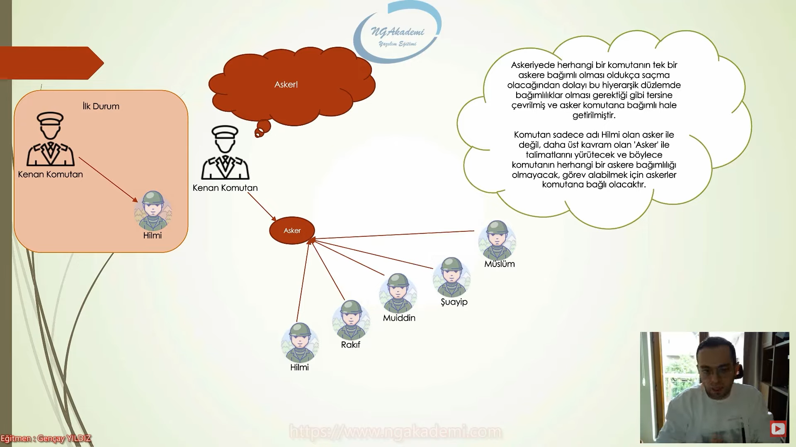
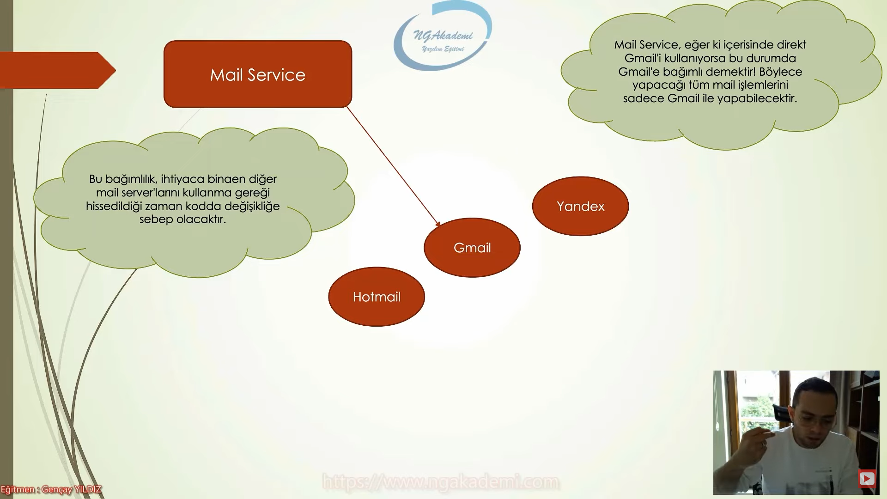
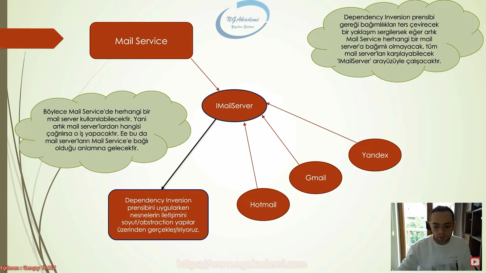
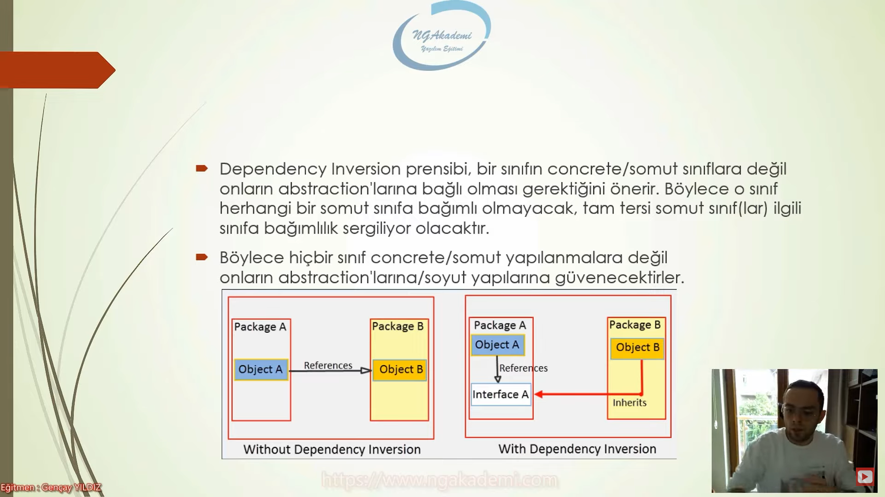

# Dependency Inversion Principle (Bağımlılığın Tersine Çevrilmesi Prensibi) Nedir?

Dependency inversion principle, bir sınıfın herhangi bir türe olan bağımlılık durumuna karşı dikkatimizi çeken ve bu bağımlılığın mümkün mertebe tersine çevrilmesini öneren bir ilkedir.

Dependency inversion principle; olayı, kurgudaki aktörü herhangi bir davranışa bağımlı kılma, davranışları aktöre bağımlı kıl. Bunu yapabilecek şekilde düşüncen olsun diyor.

Bu prensip, geliştiricinin herhangi bir türe bağımlı olmadığını bilakis türlerin / yani nesnelerin geliştiriciye bağımlı olduğunu savunur.

Bu ilkeyi anlayabilmek için birkaç örnek üzerinden istişare etmekte fayda vardır. 

  

Yazılım üzerinden örnek;

Yanlış olan:

 

Dependeny inversion ile doğru olan:

 

Özetle; yazılımda gidişat tek bir davranışa bağımlı olmamalı, bilakis davranışlar sizin kararınıza bağımlı olmalı... 

Dependency inversion prensibi, bir sınıfın concrete (somut) sınıflara değil, onların abstraction'larına bağlı olması gerektiğini önerir. Böylece o sınıf herhangi bir somut sınıfa bağımlı olmayacak, tam tersine somut sınıf(lar) ilgili sınıfa bağımlılık sergiliyor olacaktır. 

Böylece hiçbir sınıf concrete (somut) yapılanmalara değil onların abstraction'larına soyut yapılarına güvenecektir.

 

Son olarak;

Dependency inversion prensibi, sınıflar arasındaki bağımlılığı soyutlamakta, uygulamanın ihtiyaca göre davranış değişikliğine istikrar getirmekte ve sistem açısından sürdürülebilirlik  ve ölçeklenebilirliği sağlamaktadır.

